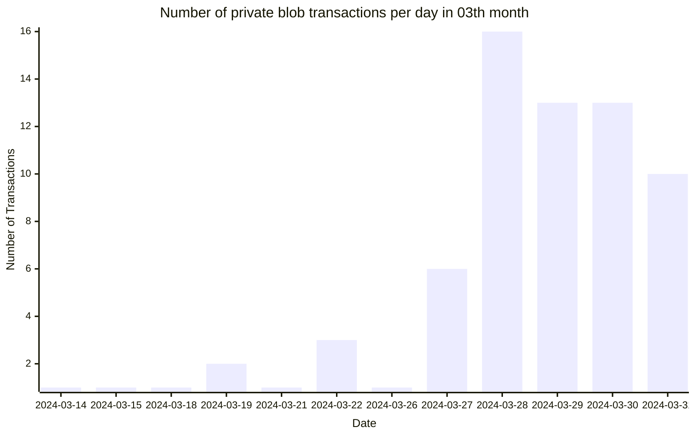
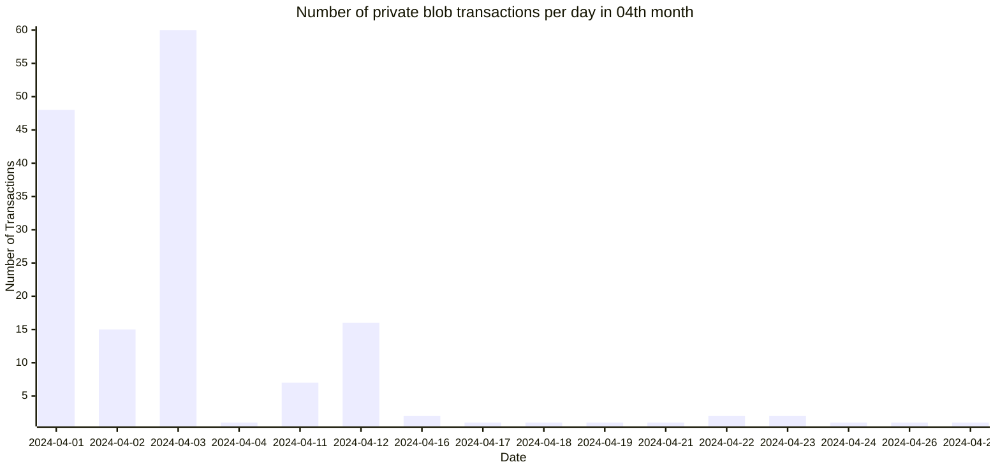
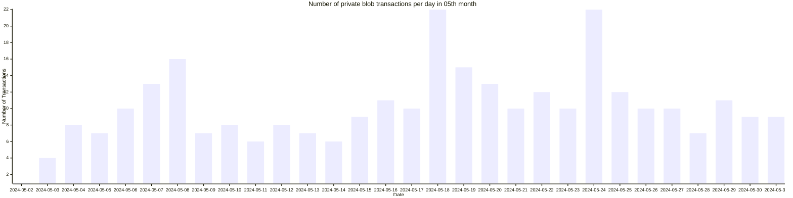
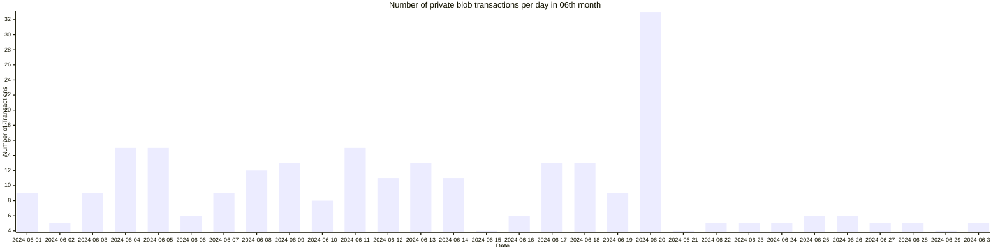
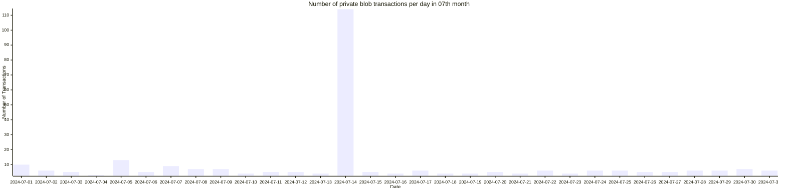
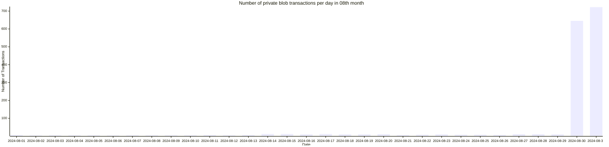
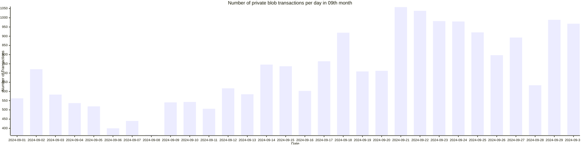
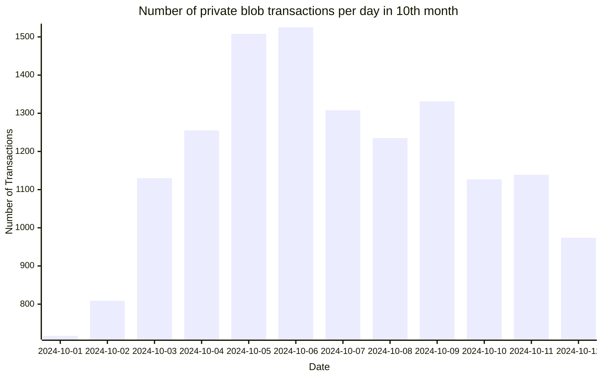

```mermaid
---
config:
    xyChart:
        width: 960
        height: 600
---
xychart-beta title "Number of private blob transactions per day in 03th month"
x-axis "Date" [2024-03-14,2024-03-15,2024-03-18,2024-03-19,2024-03-21,2024-03-22,2024-03-26,2024-03-27,2024-03-28,2024-03-29,2024-03-30,2024-03-31]
y-axis "Number of Transactions"
bar[1,1,1,2,1,3,1,6,16,13,13,10]
```

```mermaid
---
config:
    xyChart:
        width: 1280
        height: 600
---
xychart-beta title "Number of private blob transactions per day in 04th month"
x-axis "Date" [2024-04-01,2024-04-02,2024-04-03,2024-04-04,2024-04-11,2024-04-12,2024-04-16,2024-04-17,2024-04-18,2024-04-19,2024-04-21,2024-04-22,2024-04-23,2024-04-24,2024-04-26,2024-04-27]
y-axis "Number of Transactions"
bar[48,15,60,1,7,16,2,1,1,1,1,2,2,1,1,1]
```

```mermaid
---
config:
    xyChart:
        width: 2400
        height: 600
---
xychart-beta title "Number of private blob transactions per day in 05th month"
x-axis "Date" [2024-05-02,2024-05-03,2024-05-04,2024-05-05,2024-05-06,2024-05-07,2024-05-08,2024-05-09,2024-05-10,2024-05-11,2024-05-12,2024-05-13,2024-05-14,2024-05-15,2024-05-16,2024-05-17,2024-05-18,2024-05-19,2024-05-20,2024-05-21,2024-05-22,2024-05-23,2024-05-24,2024-05-25,2024-05-26,2024-05-27,2024-05-28,2024-05-29,2024-05-30,2024-05-31]
y-axis "Number of Transactions"
bar[1,4,8,7,10,13,16,7,8,6,8,7,6,9,11,10,22,15,13,10,12,10,22,12,10,10,7,11,9,9]
```

```mermaid
---
config:
    xyChart:
        width: 2400
        height: 600
---
xychart-beta title "Number of private blob transactions per day in 06th month"
x-axis "Date" [2024-06-01,2024-06-02,2024-06-03,2024-06-04,2024-06-05,2024-06-06,2024-06-07,2024-06-08,2024-06-09,2024-06-10,2024-06-11,2024-06-12,2024-06-13,2024-06-14,2024-06-15,2024-06-16,2024-06-17,2024-06-18,2024-06-19,2024-06-20,2024-06-21,2024-06-22,2024-06-23,2024-06-24,2024-06-25,2024-06-26,2024-06-27,2024-06-28,2024-06-29,2024-06-30]
y-axis "Number of Transactions"
bar[9,5,9,15,15,6,9,12,13,8,15,11,13,11,4,6,13,13,9,33,4,5,5,5,6,6,5,5,4,5]
```

```mermaid
---
config:
    xyChart:
        width: 2480
        height: 600
---
xychart-beta title "Number of private blob transactions per day in 07th month"
x-axis "Date" [2024-07-01,2024-07-02,2024-07-03,2024-07-04,2024-07-05,2024-07-06,2024-07-07,2024-07-08,2024-07-09,2024-07-10,2024-07-11,2024-07-12,2024-07-13,2024-07-14,2024-07-15,2024-07-16,2024-07-17,2024-07-18,2024-07-19,2024-07-20,2024-07-21,2024-07-22,2024-07-23,2024-07-24,2024-07-25,2024-07-26,2024-07-27,2024-07-28,2024-07-29,2024-07-30,2024-07-31]
y-axis "Number of Transactions"
bar[10,6,5,3,13,5,9,7,7,4,5,5,4,114,5,4,6,4,4,5,4,6,4,6,6,5,5,6,6,7,6]
```

```mermaid
---
config:
    xyChart:
        width: 2480
        height: 600
---
xychart-beta title "Number of private blob transactions per day in 08th month"
x-axis "Date" [2024-08-01,2024-08-02,2024-08-03,2024-08-04,2024-08-05,2024-08-06,2024-08-07,2024-08-08,2024-08-09,2024-08-10,2024-08-11,2024-08-12,2024-08-13,2024-08-14,2024-08-15,2024-08-16,2024-08-17,2024-08-18,2024-08-19,2024-08-20,2024-08-21,2024-08-22,2024-08-23,2024-08-24,2024-08-25,2024-08-26,2024-08-27,2024-08-28,2024-08-29,2024-08-30,2024-08-31]
y-axis "Number of Transactions"
bar[6,4,5,5,5,4,5,5,5,5,6,5,6,12,12,10,12,10,10,11,6,8,10,8,8,7,11,11,10,645,722]
```

```mermaid
---
config:
    xyChart:
        width: 2400
        height: 600
---
xychart-beta title "Number of private blob transactions per day in 09th month"
x-axis "Date" [2024-09-01,2024-09-02,2024-09-03,2024-09-04,2024-09-05,2024-09-06,2024-09-07,2024-09-08,2024-09-09,2024-09-10,2024-09-11,2024-09-12,2024-09-13,2024-09-14,2024-09-15,2024-09-16,2024-09-17,2024-09-18,2024-09-19,2024-09-20,2024-09-21,2024-09-22,2024-09-23,2024-09-24,2024-09-25,2024-09-26,2024-09-27,2024-09-28,2024-09-29,2024-09-30]
y-axis "Number of Transactions"
bar[563,721,583,537,519,400,440,365,541,543,506,617,585,746,737,603,764,919,709,712,1058,1038,982,980,921,797,893,634,989,968]
```

```mermaid
---
config:
    xyChart:
        width: 960
        height: 600
---
xychart-beta title "Number of private blob transactions per day in 10th month"
x-axis "Date" [2024-10-01,2024-10-02,2024-10-03,2024-10-04,2024-10-05,2024-10-06,2024-10-07,2024-10-08,2024-10-09,2024-10-10,2024-10-11,2024-10-12]
y-axis "Number of Transactions"
bar[717,809,1130,1255,1508,1525,1308,1235,1331,1127,1139,974]
```

